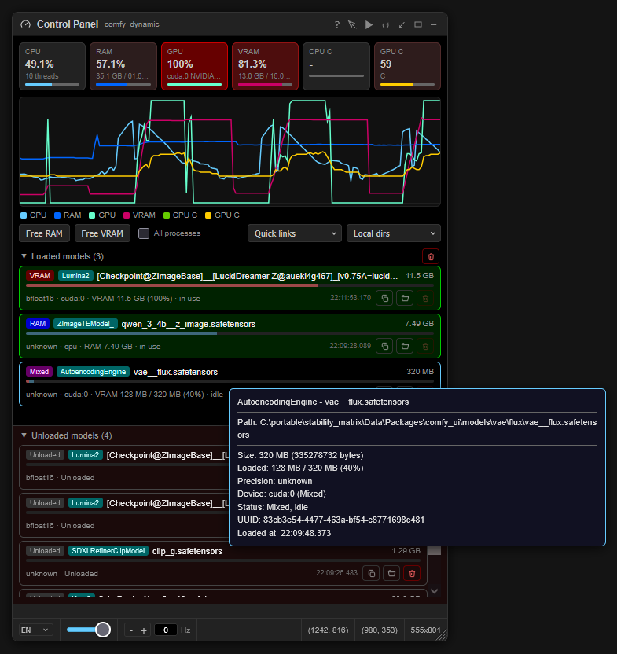
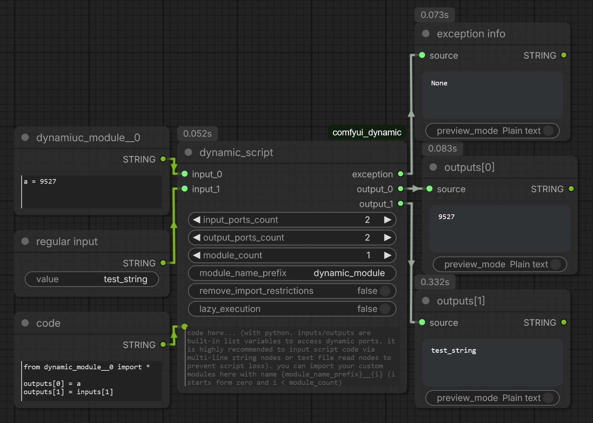
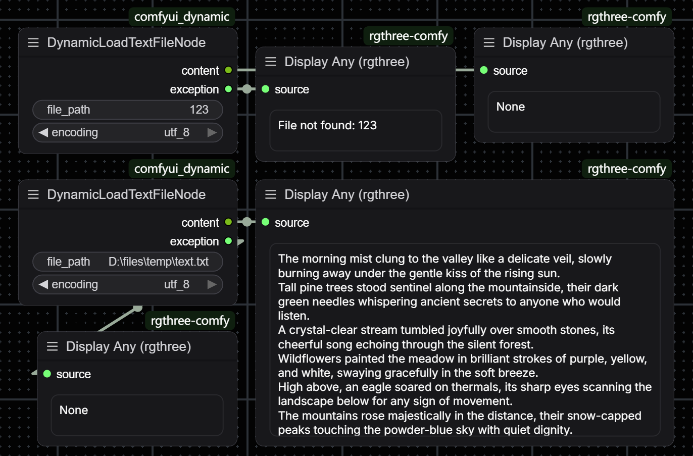

# comfyui_dynamic


[中文](./documents/README__zh_CN.md)


## 1. Abstract

- Adds the following nodes for ComfyUI:
  - Python script node (DynamicScriptNode)
  - File reading node (DynamicLoadTextFileNode)
  - Dynamic pipe node (DynamicPipeAnyNode)
  - Dynamic switch node (DynamicSwitchAnyNode)
  - Random number node (DynamicRandomNumberNode)
  - None node (DynamicNoneNode)
  - Universal selector node (DynamicUniversalSelector)
- Bundled resource monitor control panel (no nodes required, appears automatically on page load, see below)
- Plugin directory = `/comfyui_dynamic`
- **LICENSE** = `GNU Lesser General Public License v3.0`


## 2. Introduction

**comfyui_dynamic adds the following nodes**

- **Control Panel (Resource Monitor)**
  - A floating resource monitoring and management panel in the browser,
    usable without any nodes (appears automatically when the page loads)
  - Resource monitoring
    - Stat cards: CPU / RAM / GPU / VRAM utilization and CPU / GPU temperature (temperature full scale = 100 C)
    - Chart: recent history of the above six series (keeps 180 sample points, window length depends on the refresh rate),
      utilization is mapped to 0-100%, temperature to a 20-100 C window for better readability
    - Cards fade to red above 50% usage
  - Alerts: any temp above 90 C / VRAM almost full (free below max(2%, 512 MB))
    / RAM free below 10% / backend disconnected
    - The header icon is a dashboard in normal state and turns into a red warning triangle on alerts;
      when the backend is disconnected, the subtitle shows the disconnection
  - Model management
    - Loaded model list: shows full details such as path / size / precision / device / status (in use or idle)
      - Row buttons: copy full details / locate the file in the file manager / unload from RAM/VRAM (unavailable while a task is running)
      - Green border means the model is in use, the bottom bar shows the model size relative to the primary GPU VRAM
        (red = resident in VRAM, blue = remaining in RAM)
    - Unloaded model list: records of models released since page load (newest first, reference only),
      with single record removal or clear all
    - Free VRAM: automatically deferred to after the current task when busy; RAM-resident models are not affected
    - Free RAM: always runs immediately, even during a task; an optional "all processes" mode
      also trims working sets of other processes (Windows, may affect running programs)
  - Panel interactions
    - Drag by the header; dock/undock (bottom-left, undocking restores the previous floating position);
      minimize/restore (double-click the title); vertical maximize (fills the page height);
      reset (default size + dock)
    - Automatically minimizes when a large dialog (settings/templates etc.) opens, and restores after it closes
    - Adjustable opacity (30-100%); click-through support (the panel ignores mouse events,
      only the toggle button remains interactive)
    - Refreshing can be paused; UI supports English and Chinese
    - Quick links and local dirs: shortcuts to common websites, and direct access to
      model directories registered in ComfyUI
    - All settings persist via ComfyUI settings (localStorage fallback)
  - Environment notes
    - GPU monitoring (utilization/VRAM/temperature) requires an NVIDIA GPU (via NVML)
    - CPU temperature on Windows requires LibreHardwareMonitor or OpenHardwareMonitor running;
      without them it degrades to ACPI thermal zone temperature (reflects the motherboard zone
      rather than CPU cores, limited accuracy), and if none is available there is no data
    - On Linux / macOS, CPU temperature is read via psutil sensors (hardware dependent)

  

- `DynamicScriptNode`

  > **Attention !!!!!**
  >
  > - When executing workflows containing `DynamicScriptNode`, please be sure to check the security of the code in the node !!!
  > - The code of this node can be passed in from other nodes, please be sure to pay attention !!!
  > - Package import restrictions can improve security to a certain extent, but code review is still required
  > - If you cannot determine the security of the code, you can try having an AI check it

  - Used to dynamically execute Python code in workflows
    - Can set a variable number of input and output terminals
    - Has a fixed exception information output terminal (outputs None when there is no exception, otherwise outputs the exception object)
      - Can use "Preview Any" and other nodes to display the content
    - The execution environment is basically equivalent to the ComfyUI environment, can create nodes and execute, clear VRAM or perform any other operations
    - By default, only some commonly used Python modules can be used
      - After removing package import restrictions, any module can be used, and the node will turn red
  - Refreshing nodes in some versions of ComfyUI may cause code loss
    - Try to avoid editing code directly in the node's text box
    - Can use multiline string nodes or text file reading nodes to input code into this node
    - Using VS Code to edit and save complete code files on your hard drive is a good choice
  - Now supports custom module import
    - Through the new `module_name_prefix` and `module_count` ports
    - module_name_prefix: Used to define the module name
    - module_count: Declares how many of the dynamic inputs are used as custom module code (0 means disabled)
  - Now supports cross-execution shared cache
    - A global singleton dictionary named `cache` is injected into the script environment, accessible in code
    - Shared by all `DynamicScriptNode` instances, can store computation-heavy values in it
    - The add, delete, modify and query of this dictionary are entirely the responsibility of your code
    - This cache dictionary only exists in memory, and is cleared after ComfyUI service restart
    - Note: When using `cache`, the script is no longer a pure function, so `lazy_execution` is generally not enabled, which can easily cause errors

    ```python
    # Example: Store computation-heavy values in cache
    if "heavy_value" not in cache:
        cache["heavy_value"] = expensive_computation(inputs[0])
    outputs[0] = cache["heavy_value"]
    # ...
    del cache["heavy_value"]  # Remove stored value
    ```

  - Other properties
    - `is_output_node` = True

  - More details can be found in ComfyUI's built-in node documentation page ("Node Info" in the menu)

  


- `DynamicLoadTextFileNode`
  - Reads text files on the hard drive via the provided path
  - Supports selecting file encoding, with a built-in list of all available text encodings
  - Has an exception information output terminal, outputs the exception object when reading fails instead of directly reporting an error and interrupting the workflow
  - Supports file content change detection, the node will automatically re-execute when the file is modified (using MD5 checksum)
  - Can be used with `DynamicScriptNode` to dynamically load code files and pass them into the script node for execution

  


- `DynamicPipeAnyNode`
  - Dynamic pipe node, used to pack multiple data into a list (pipe) output, while also supporting unpacking
  - Set the number of dynamic input/output ports via `ports_count` (0 ~ 100)
  - Accepts a `pipe` input (can be a Python list or tuple):
    - If `pipe` length is less than `ports_count`, automatically padded with `None` to the specified length
    - If `pipe` length is greater than `ports_count`, automatically truncated to the specified length
    - If `pipe` is not connected or the type is invalid, initialized to an all-`None` list
  - Dynamic input ports `input_0`, `input_1`, ... will override the corresponding position values in `pipe`
  - Fixed output port `pipe` outputs the complete list
  - Dynamic output ports `output_0`, `output_1`, ... output each element in the list respectively
  - Other properties
    - `is_output_node` = True


- `DynamicSwitchAnyNode`
  - Switch/branch node, selects and returns the corresponding input value based on index
  - Set the number of dynamic input ports via `cases_count` (0 ~ 100)
  - Specify the input index to return via `index`, corresponding to dynamic input ports `case_0`, `case_1`, ...
  - Supports **lazy execution**: Only the selected `case_N` branch is executed, unselected upstream nodes are not triggered
  - When `index` is out of range (less than 0 or greater than or equal to `cases_count`), returns the `default` value
  - `default` input is optional, if not connected it is treated as `None` by default
  - All input ports support any type


- `DynamicRandomNumberNode`
  - Random integer generation node
  - Specifies the random number range via `min` (inclusive) and `max` (exclusive)
  - Generates a new random value each execution, can be used in scenarios requiring changing seeds in workflows
  - This node refreshes every execution, ensuring a different random number each time


- `DynamicNoneNode`
  - Null value node, always returns `None`
  - Accepts an input `any` of any type, but this input is completely ignored
  - Can be used for placeholder, initialization or as a default value passed to other nodes

- `DynamicUniversalSelector`
  - Used to quickly query various file/option names in the ComfyUI environment
  - Supports querying by category
  - Supports regex matching
  - Returns a list of items matching the pattern
  - Very useful when you need to get text for certain model files. Practical use cases:
    - Workflows require text-based configuration
    - Too many model files to manage conveniently
    - Need to quickly view all valid sampler or scheduler options


## 3. Installation

- Clone this repository into ComfyUI's `custom_nodes` directory:

  ```shell
  cd path_to_comfyui/ComfyUI/custom_nodes
  git clone https://github.com/inkbottle-9/comfyui_dynamic.git
  ```

- Version requirement: This plugin has been migrated to the ComfyUI V3 node specification, requiring a relatively new version of ComfyUI
  - Approximately requires versions after the second half of 2025, latest version is recommended
  - For older ComfyUI versions, please use historical versions of this plugin, the last version using the old API:
    - `de7b4914835994f91b5bb1863a65e384c648c932`

      ```shell
      git checkout de7b4914835994f91b5bb1863a65e384c648c932
      git switch --detach de7b4914835994f91b5bb1863a65e384c648c932
      ```


## 4. Dependencies

- No dependencies for node execution
- The control panel (resource monitor) requires the following Python packages
  (installed automatically by ComfyUI when installing the plugin):
  - `psutil`: CPU / RAM statistics (already a dependency of the ComfyUI core, declared here explicitly)
  - `pynvml`: GPU utilization and temperature (optional, degrades automatically when missing
    or on non-NVIDIA environments, only the monitoring feature becomes unavailable,
    the rest of the plugin is not affected)


## 5. Settings

**This plugin registers the following settings in the ComfyUI settings interface:**

- `Warn when loading workflows with unrestricted import`
  - When enabled (default): When loading workflows containing `DynamicScriptNode` with package import restrictions removed,
    a security warning will pop up, and the relevant nodes will remain restricted unless confirmed
  - When disabled: Loading workflows will no longer pop up this warning, nodes are loaded as saved in the workflow (at your own risk)
- `Enable logging`
  - When enabled (default): Information will be output to the log when executing certain nodes, viewable in the ComfyUI console
  - When disabled: No log output
  - Requires software restart after modification to take effect
  - Recommended to enable, `DynamicScriptNode` will output exceptions in a readable form to the log when execution encounters errors
- `Dynamic Resource Monitor: Enabled`
  - When enabled (default): The control panel is shown after the page loads
  - When disabled: The panel is hidden and data polling stops, changes take effect immediately without restart
- `Dynamic Resource Monitor: Refresh rate (Hz, 0 = paused)`
  - Data polling rate of the control panel (0-10, default 2), 0 means paused, changes take effect immediately
- `Dynamic Resource Monitor: Language`
  - `en` (default) / `zh`, changes take effect immediately
- `Dynamic Resource Monitor: Panel opacity (30-100%)`
  - Default 100%, changes take effect immediately


## 6. Notes

- Migrated to the new ComfyUI API, now supports Node 2.0
- The plugin may have bugs, if problems are found during use, please be sure to submit relevant information on the issue page
  - Your feedback is really needed
- If you have any suggestions for feature implementation, or need other features, please feel free to post an issue
