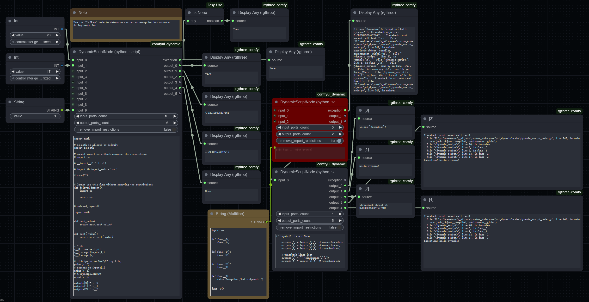
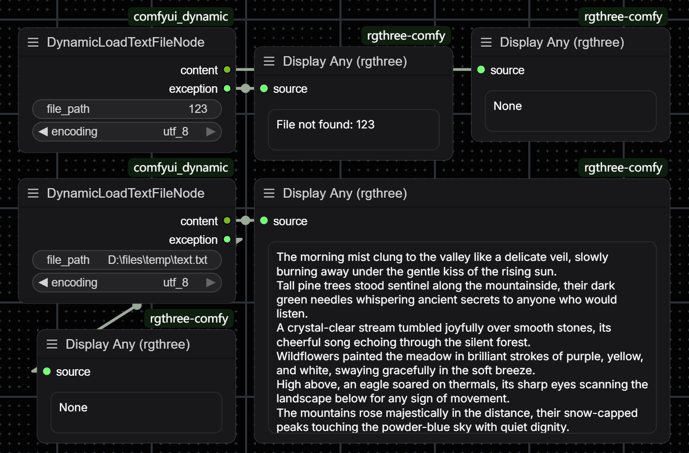

# comfyui_dynamic

[英文](../README.md)


## 1. 摘要

- 为 ComfyUI 添加全功能的 (可能也没那么全) python 脚本节点
- 插件目录 = `/comfyui_dynamic`
- **LICENSE** = `GNU Lesser General Public License v3.0`


## 2. 介绍

**comfyui_dynamic 添加了如下节点**

> **注意 !!!!!**
>
> - 执行包含 `DynamicScriptNode` 的工作流时请务必检查节点中代码的安全性 !!!
> - 本节点的代码可以从其它节点中传入, 请务必注意 !!!
> - 包导入限制可以一定程度上提升安全性, 但仍需代码检查
> - 如果您无法确定代码的安全性, 可以尝试交给 AI 检查

- `DynamicScriptNode`
  - 用于在工作流中动态执行 python 代码
  - 可以具有若干个动态添加的输入端和输出端
  - 具有固定的异常信息输出端 (无异常时输出 None, 否则输出异常对象)
    - 可以使用 Display Anything 节点显示内容
  - 更多详细信息可在 ComfyUI 内置的节点文档页面找到 (菜单里的 "Node Info")
  - 刷新节点可能会导致代码丢失, 尽量避免直接在节点的文本框中编辑代码
    - 可以使用多行字符串节点或文本文件读取节点输入代码至该节点
    - 使用 vs code 编辑并在您的硬盘上保存完整的代码文件是很好的选择

  

- `DynamicLoadTextFileNode`
  - 通过提供的路径读取硬盘上的文本文件

  


## 3. 安装

- 将本仓库克隆到 ComfyUI 的 `custom_nodes` 目录:

  ```shell
  cd ComfyUI/custom_nodes
  git clone https://github.com/inkbottle-9/comfyui_dynamic.git
  ```


## 4. 依赖

- 无依赖


## 5. 注释

- 该插件暂不支持 Node 2.0 (不知道咋写)
- 插件可能会有错误, 使用过程中若发现问题请务必于议题 (issue) 页提交相关信息
- 如果对功能实现有什么建议, 或者需要其它的功能, 可以发表议题 (issue)

